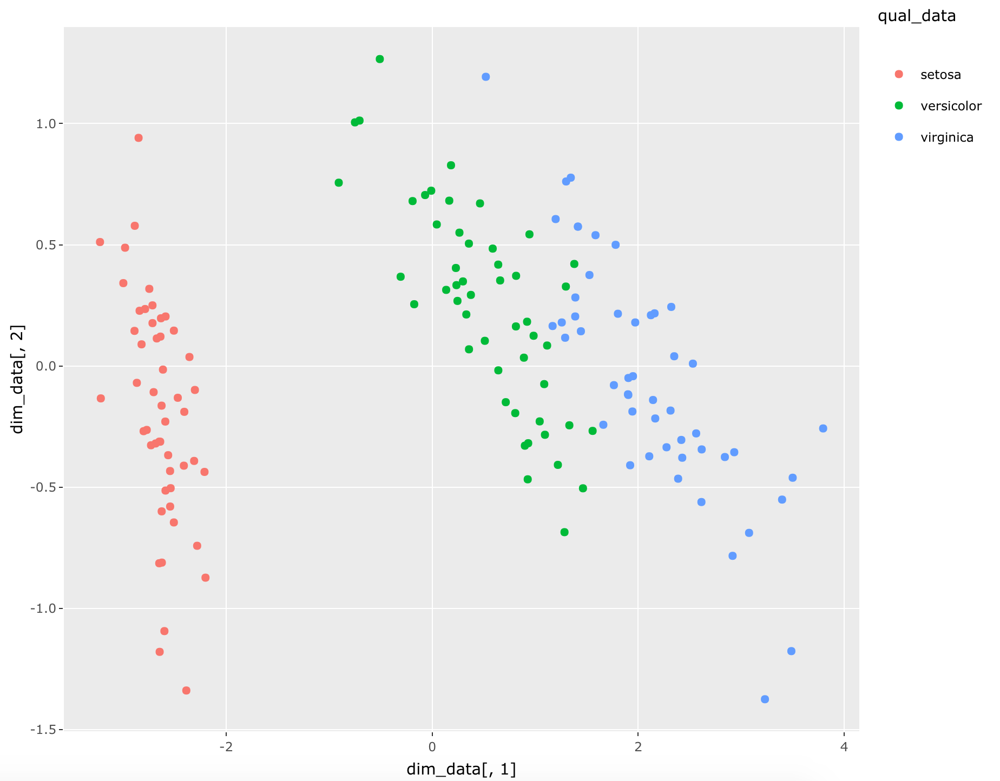
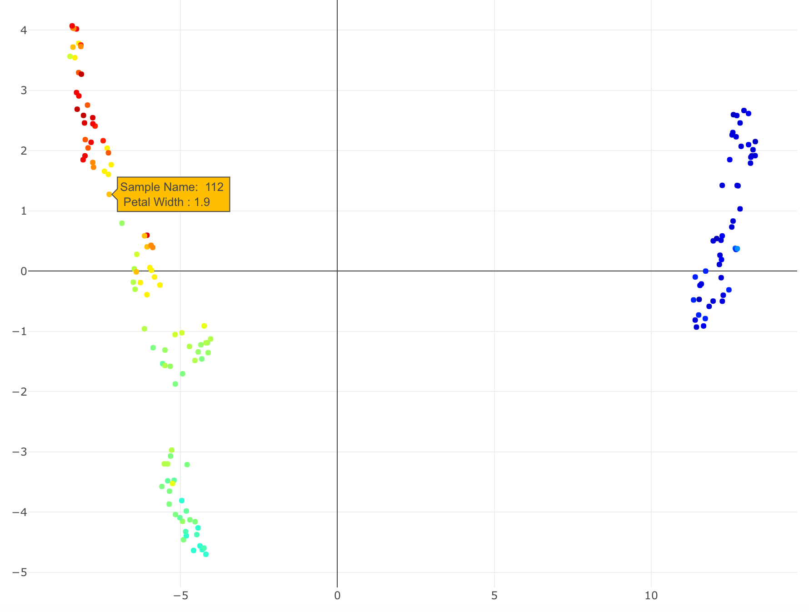
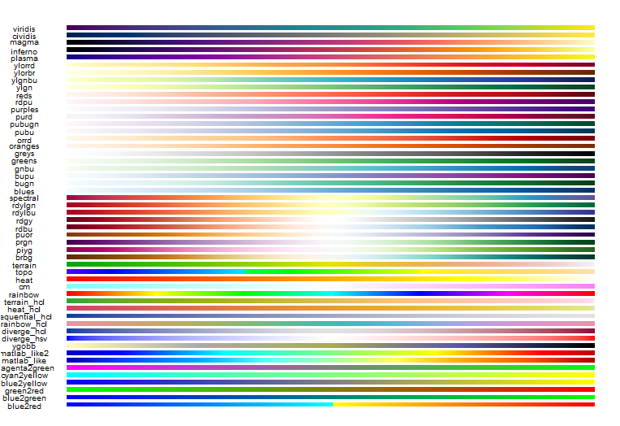

<!-- README.md is generated from README.Rmd. Please edit that file -->

# interactmapper

<!-- badges: start -->

[](https://travis-ci.org/octaviamd/interactmapper?branch=master)
[](https://ci.appveyor.com/project/octaviamd/interact-mapper)
<!-- badges: end -->

The goal of interactmapper is to make analyzing dimension reduction
plots more intuitive and user-friendly, by allowing users to overlay
features of interest of the dataset onto the plot via color

## Installation

You can install the released version of interactmapper from
[CRAN](https://CRAN.R-project.org) with:

``` r
install.packages("interactmapper")
```

And the development version from [GitHub](https://github.com/) with:

``` r
# install.packages("devtools")
devtools::install_github("octaviamd/interactmapper")
```

## interact\_qual

Here is a walkthrough of how to use the different functions in the
interactmapper package. For greater ease, the `iris` dataset will be
used to show how the functions can be used. Illustrative gifs showing
the kinds of interactive plots that can be generated will be provided
soon\!

The `interact_qual` function is best suited to represent qualitative
features of your data (ex: race/ethnicity of patients, smoker status,
treatment groups, cell types, etc…). In the example below, the dimension
reduction method `UMAP` is applied to the `iris` dataset, which is
plotted and color coded based on `iris$Species`, representing the
Species of each iris represented in the dataset. Upon mouse hover, the
qualitative feature of interest is presented in a text box, as well as
the sample name.

``` r
library(interactmapper)
#interactmapper::interact_qual(iris[,1:4], iris$Species, "UMAP")
```


The plot generated by `interact_qual` also has a helpful side-bar that
displays all of the variant options of your qualitative feature of
interest, and allows you to select which variant(s) you want represented
on your plot. By clicking on the feature option names, you can either
show or hide the points associated with those features. In the UMAP plot
below, setosa and versicolor have been hidden in order to have a better
look at the virginica irises.


Here is an example of applying PCA instead of UMAP to the same data,
looking at the same feature, `iris$Species`.

``` r
#interactmapper::interact_qual(iris[,1:4], iris$Species, "PCA")
```



## interact\_quant

The `interact_quant` function is used to represent features that are
quantitative in nature (gene expression, DNA methylation, height, etc…).

``` r
#interact_quant(iris[,1:4], "Petal Width",  iris[,4], "UMAP")
```

Below you can see an example of the `interact_quant` function being
applied to color the datapoints of the plot based on the feature of
interest, the petal width of the irises. Upon hovering over a point, a
pop-up box displaying the Sample Name and the feature of interest
appears. 

The color palette used can be chosen from a range of available palettes
from the package
[colourvalues](https://github.com/SymbolixAU/colourvalues) displayed
below based on your preferences to best suit your data and how to
display it:



The default palette option is “matlablike_2”. Here is the same plot,
only with the palette
“viridis”.

``` r
#interactmapper::interact_quant(iris[,1:4], "Petal Width",  iris[,4], "UMAP", "viridis")
```


## interact_multi

To display information on multiple features on mouse hover over data points, you can use the `interact_multi` function.
In this case, following the dataset argument, the main feature of interest is the next argument: this provides the data that is used for the colours of your datapoints, and is also included in the information hover text-box. Following that argument is the secondary feature argument, where you can designate the secondary features you are interested in.

In the example below, you can see the Sepal Length selected as the main feature of interest, with the Species selected as the secondary feature of interest.


``` r
#interactmapper::interact_multi(iris[,1:4], iris$Sepal.Length, iris$Species, "UMAP", "viridis", "Sepal Length", "Species")
```


You can select multiple secondary features of interest, as seen in the example below. `interact_multi` is suited to represent both qualitative data and quantitative data as the main feature of interest.

``` r
#interact_multi(iris[,1:4], iris$Species, iris[,1:2], "UMAP", "viridis", "Species", c("Sepal Length", "Sepal Width"))
```

You’ll still need to render `README.Rmd` regularly, to keep `README.md`
up-to-date.
